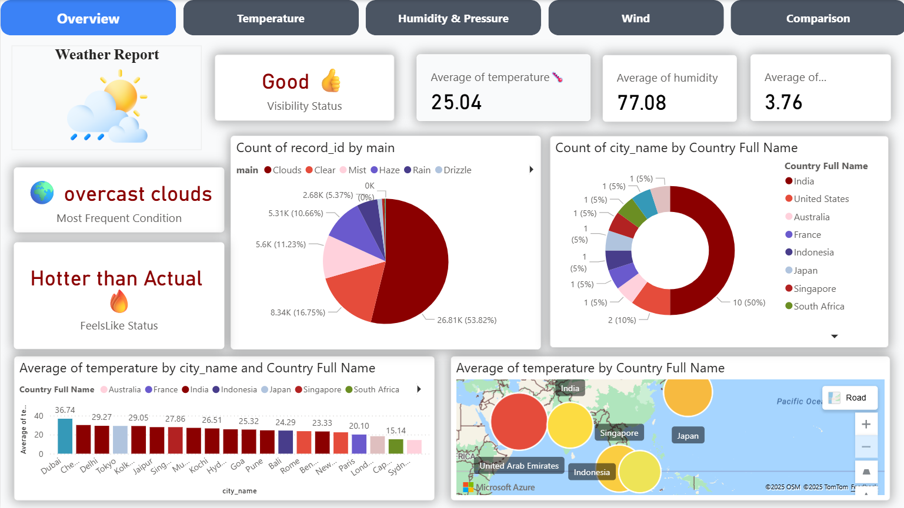

# 🌦️ Weather Analytics Dashboard (Power BI Project)

## 📌 Project Overview
This is a **self-initiated Power BI project** where I extracted raw weather data, transformed it, and built an **interactive dashboard** for city-wise weather analysis.  
The project showcases **live connections with SQL (DirectQuery)** as well as **Dual Storage Mode** for optimized performance.  
By handling both **real-time data** and **imported snapshots**, the dashboard provides a balance of speed and freshness.

## 🎯 Key Features
- 🔗 **Live Connection (DirectQuery)** – connected Power BI directly to SQL database for real-time data.  
- 🗂️ **Dual Mode** – used for frequently queried tables to improve report performance while keeping live sync.  
- 📊 **Interactive Dashboard** – compare cities with slicers & filters.  
- 🌡️ **Temperature Insights** – highest/lowest temperatures per city.  
- 🌧️ **Rainfall Events** – calculated rain, drizzle, thunderstorm events per city.  
- 👁️ **Visibility & Feels Like** – daily averages for weather comfort.  
- ⛈️ **Most Frequent Weather Condition** – shown with **emoji labels** 🌦️☀️❄️.  
## 📸 Dashboard Preview

## 🛠️ Tools & Technologies
- **Power BI (DirectQuery + Dual Mode + Import)** – for dashboarding and optimized data modeling.  
- **DAX** – custom measures (rain events, max/min temperatures, frequent conditions).  
- **SQL** – extracted and cleaned raw weather records before loading.  
- **Power Query** – transformation, merging condition tables, and column engineering.  

## 📂 Files in this Repository
- `Weather_Dashboard.pdf` → Exported dashboard (static view).  
- `Weather_Dashboard.pbix` *(optional)* → Power BI file with model & DAX.  
- `README.md` → Documentation.  

## 🚀 Future Enhancements
- ⏱️ Real-time **streaming dataset** for continuous updates.  
- 📈 Weather trend forecasting (Python + Power BI integration).  
- 📡 API-based refresh pipeline for fully automated updates.  

## 🔗 Demo
📄 [View Report PDF](./Weather_Report.pdf)  
